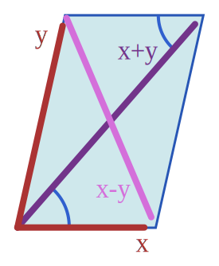

# 微观世界的角动量

## 宏观世界的角动量

首先我们回顾一下角动量的定义，给定一个转轴和物体的位置及动量矢量 $\mathbf{r}$ 、 $\mathbf{p}$ ，那么这个物体所具有的角动量就是
$$
\vec{L} = \mathbf{r} \times \mathbf{p}
$$
如下图所示

其中 $\vec{L}$ 与转轴共线，它的方向可以由右手定则确定。

与动量的意义类似，角动量也是一种守恒量，这使得在研究某些问题时以角动量守恒为出发点会更容易一些。

*闲话* ：为什么角动量是一种守恒量？

回答这个问题之前我们联想一下其他的守恒量：动量。一个量如果是守恒的，说明它一定存在某种对称性；比如将这个系统在空间中平移后系统的动量不改变，那么这个系统的动量就是守恒的（满足平移对称性）。同样的道理，角动量守恒是因为系统旋转一个角度，角动量不变（旋转对称性）。当系统含有有心力时一般都会满足角动量守恒，如点电荷对周围电荷的库仑力不会因为旋转一个角度而发生改变。说到这里我们又联想到了能量守恒，那么能量为什么守恒？普遍的观点是因为系统的哈密顿量对于时间是平移对称的（ $\partial H / \partial t = 0$ ），所以能量也是守恒的。

### 角动量的合成

和一般矢量一样，经典图像里角动量的合成也遵循矢量合成法则，即[平行四边形定则](https://en.wikipedia.org/wiki/Parallelogram_law)（或三角形定则）

不妨设存在任意两个角动量 $\mathbf{L}_1$ 、 $\mathbf{L}_2$ ，所合成的到的矢量为 $\mathbf{L}_3$ ，$\mathbf{L}_3$ 所对应的方向矢量为 $\hat{\mathbf e}$ ，它们对应的模长分别为 $L_1$ 、 $L_2$ 、$L_3$ 和 1，则有
$$
\begin{gather}
	\mathbf{L_1} + \mathbf{L_2} = \mathbf{L}_3 = L_3 \hat{\mathbf e} \\
	|\mathbf{L}_1 + \mathbf{L}_2| = |\mathbf{L}_3| = L_3 \\
	| L_1 - L_2 | \le L_3 \le L_1 + L_2
	
\end{gather}
$$
上式中 $L_3$ 的值可以在 $|L_1 - L_2|$ 到 $L_1 + L_2$ 之间**连续**变化；

这个过程也可以看成由**两个向量合成得到另一个向量乘以一个系数**。

## 电子的轨道角动量

到了微观世界，一切变得不那么明晰起来。让我们从电子的轨道角动量讲起。

1913 年，玻尔建立了玻尔原子模型，他通过「对应性原理」导出电子的角动量大小应该是 $n\hbar$ ，然而问题来了：

1. 既然有角动量，那么角动量的方向在哪里？换言之，电子绕核旋转的轴是朝向哪里的？
2. 如果电子仍然以经典的物理图像绕某轴旋转，那么根据角动量守恒，它应该在某个平面内运动，所以这个如何确定这个平面？
3. 玻尔在使用「对应性原理」导出角动量的表达式时是在「当主量子数 $n$ 很大时」才能「近似认为电子绕核的角动量等同于用经典方法计算出的角动量」，那么当 $n$ 比较小时，这个近似也成立吗？
4.  [Stern-Gerlach](https://en.wikipedia.org/wiki/Stern–Gerlach_experiment) 实验表明，电子角动量的**空间取向**是量子化的，即相对于观察者，电子的角动量只能取几个特定的角度，这也是玻尔模型所无法解释的。

现在我们知道，描述一个电子的轨道角动量我们需要两个量子数 $l$ 和 $m$ ，它们分别影响电子轨道角动量的大小和角动量在 $z​$ 轴方向上的投影大小。这里说明一下，我们此时选取的坐标系是实验室坐标系，所讨论的量都是**观测**得到值。

电子的轨道角动量的值
$$
L = \sqrt{l(l + 1)} \hbar
$$
电子轨道角动量的空间取向也是量子化的，即在 $z$ 轴方向上，轨道角动量只能取 $\hbar$ 的整数倍 $m\hbar$ 

例如

- 处在 s 态的电子，角量子数 $l$ 为 0 ，故其轨道角动量是 0 ，那么轨道角动量在 $z$ 轴上的投影也一定是 0 ；
- 处于 p 态的电子，角量子数 $l$ 为 1 ，轨道角动量的大小为 $\sqrt{2}\hbar$ ，轨道角动量在 $z$ 轴上的投影可以为 $-\hbar$, 0, $+\hbar$ ；
- 处于 d 态的电子，角量子数 $l$ 为 2 ，轨道角动量的大小为 $\sqrt{6}\hbar$ ，轨道角动量在 $z$ 轴上的投影可以为 $-2\hbar$, $-\hbar$, $0$, $+\hbar$ , $+2\hbar$ ；
- 由此类推……

现在问题来了，在上面的图像中我们只确定了电子角动量的 **大小** 和其在 $z$ 轴上的 **投影** ，根据经典图像，这样的条件并不能使我们在空间中 **确定** 一个轴。但是请注意，我们现在在讨论的是量子化效应明显的微观世界中的情形，在这种情况下，我们 **姑且** 认为电子是在绕着 $z$ 轴做 **进动** ，即角动量 $\mathbf{L}$ 扫过的轨迹是一个锥面，并且这个进动确实有着自己的角频率（具体数值限于本人水平，并不太确定），所以我们只需要两个自由度便可以描述一个电子的角动量。

## 电子的自旋角动量

我们使用 $S​$ 表示电子自旋的大小。

1920s， Stern-Gerlach 实验证明了电子自旋的存在，由自旋产生的自旋角动量也被测出，与轨道角动量不同的是，电子的自旋角动量大小只有一个值 $S = \sqrt{\frac{1}{2} (\frac{1}{2} + 1)} \hbar= \frac{\sqrt 3}{2} \hbar$ ，并且它在 $z$ 轴上的投影只能是 $+\frac{1}{2}\hbar$ 或 $-\frac{1}{2} \hbar$ 。

电子的自旋角动量也可以看成是在绕着 $z$ 轴做进动，进动的角频率被称为[拉莫频率](https://en.wikipedia.org/wiki/Gyroradius)，它的大小为
$$
\Omega_L = \frac{|E_{\uparrow} - E_{\downarrow}|}{\hbar}
$$
其中 $E_{\uparrow}​$ 与 $E_{\downarrow}​$ 分别是自旋为 $+\frac{1}{2}​$ 和 $-\frac{1}{2}​$ 时电子的能量（看起来和电子跃迁有关，事实确实如此，不过这个内容不在本文讨论范围之内）。

# 角动量的耦合

本文中，角动量耦合特指在微观世界中两个角动量的耦合。这其中「耦合」即为合成之意。

为了表达方便，后面我们将直接使用量子数来表示角动量，轨道角动量 $L$ 的量子数为 $l,\; l\in N$ ，自旋量子数为 $s,\; s\in \{-\frac{1}{2}, +\frac{1}{2}\}​$

在耦合过程中，不光要满足矢量合成法则，其合成得到的角动量也要满足量子化条件。

如电子的轨道角动量和自旋角动量耦合得到的总角动量
$$
\mathbf{J} = \mathbf{L} + \mathbf{S}
$$
不妨取 $l = 2$ ，那么得到的 $j$ 值可以是多少呢？

我们借助三角形定则来帮助确定 $j$ 值的取值

# Clebsch-Gordan 系数